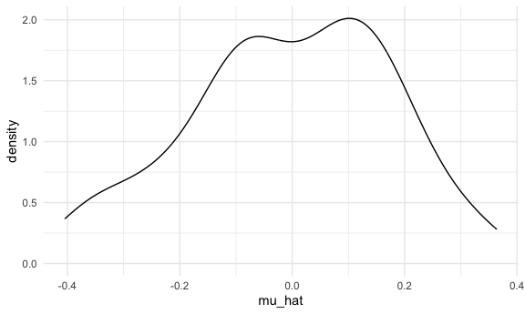
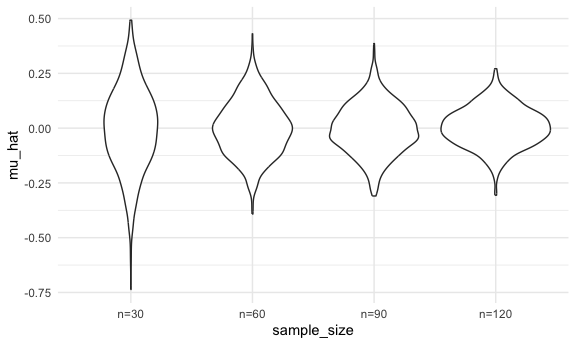
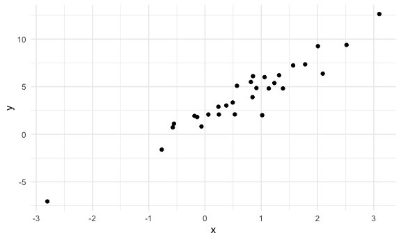
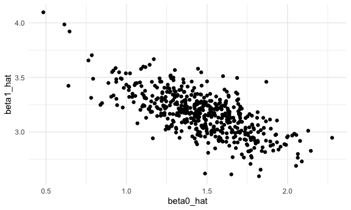
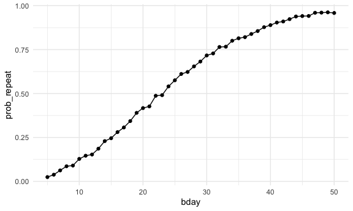

simulation
================
Zihan Xiong
2025-11-14

load key packages and source necessary files

``` r
library(tidyverse)
```

writing a function

``` r
sim_mean_sd=function(n_subj){
  x=rnorm(n_subj, mean=0, sd=1)
  
  tibble(
    mu_hat=mean(x),
    sigma_hat=sd(x))
}
sim_mean_sd(n_subj=400)
```

    ## # A tibble: 1 × 2
    ##   mu_hat sigma_hat
    ##    <dbl>     <dbl>
    ## 1 0.0144      1.01

``` r
output=vector("list", length=100)
for (i in 1:100) {
  output[[i]]=sim_mean_sd(30)#从总体中抽30个样本,算一次样本均值,重复100次
}

output |> bind_rows() |> #把list里的100个小tibble叠在一起
  ggplot(aes(x=mu_hat))+
  geom_density()
```



``` r
#根据CLT,分布近似正态, 均值接近总体均值
```

``` r
#更系统的验证
sim_results_df=
  expand_grid(#生成所有组合的实验设计表, 得到一个4000*2列的tibble
    sample_size=c(30,60,90,120),
    iter=1:1000
  ) |>
  mutate(
    results=map(sample_size, sim_mean_sd)
  ) |>
  unnest(results)
```

violin plot

``` r
sim_results_df |>
  mutate(
    sample_size=str_c("n=", sample_size),
    sample_size=fct_inorder(sample_size)
  ) |>
  ggplot(aes(x=sample_size, y=mu_hat))+
  geom_violin()
```



``` r
sim_results_df |>
  group_by(sample_size) |>
  summarize(
    emp_mean=mean(mu_hat),
    emp_se=sd(mu_hat)
  )#用数字验证CLT, 样本均值的平均值接近总体均值
```

    ## # A tibble: 4 × 3
    ##   sample_size  emp_mean emp_se
    ##         <dbl>     <dbl>  <dbl>
    ## 1          30  0.000121 0.178 
    ## 2          60  0.00693  0.125 
    ## 3          90 -0.00193  0.110 
    ## 4         120 -0.00229  0.0892

simple linear regression模拟一份简单线性回归

``` r
sim_df=
  tibble(
    x=rnorm(30,mean=1,sd=1),#x~Normal(1,1)
    y=2+3*x+rnorm(30,0,1)
  )
sim_df
```

    ## # A tibble: 30 × 2
    ##         x       y
    ##     <dbl>   <dbl>
    ##  1  0.783  4.94  
    ##  2  0.586  2.21  
    ##  3  0.923  6.07  
    ##  4  1.16   6.56  
    ##  5  0.921  4.44  
    ##  6  1.29   6.33  
    ##  7 -0.288  1.43  
    ##  8 -0.461  0.0543
    ##  9 -1.72  -1.28  
    ## 10 -0.275  0.337 
    ## # ℹ 20 more rows

生成的数据关系

``` r
sim_df |>
  ggplot(aes(x=x,y=y)) +
  geom_point()
```



``` r
slr_fit=lm(y~x,data=sim_df)#lm拟合线性回归,
coef(slr_fit)#coef输出估计的beta0 and beta1
```

    ## (Intercept)           x 
    ##    2.034119    3.256006

模拟封装成一个函数sim_regression()

``` r
sim_regression=function(n_subj, beta_0=1.46, beta_1=3.17) {#sample size=n_subj
  sim_df=
    tibble(
      x=rnorm(n_subj,mean=1,sd=1),
      y=beta_0+beta_1*x+rnorm(n_subj,0,1)
    )
  slr_fit=lm(y~x, data = sim_df)
  
  tibble(
    beta0_hat=coef(slr_fit)[1],
    beta1_hat=coef(slr_fit)[2]#长度为2的向量,c("intercept")和斜率
  )#把他们装进tibble,这样可以在for-loop或map里用bind_rows()合并
}
```

验证

``` r
sim_regression(n_subj=30)
```

    ## # A tibble: 1 × 2
    ##   beta0_hat beta1_hat
    ##       <dbl>     <dbl>
    ## 1      1.52      3.12

## 用for-loop重复模拟500次

``` r
output=vector("list", length=500)

for (i in 1:500) {
  output[i]=sim_regression(n_subj=30)
}
output |>
  bind_rows()
```

    ## # A tibble: 500 × 1
    ##    `(Intercept)`
    ##            <dbl>
    ##  1          1.35
    ##  2          1.54
    ##  3          1.56
    ##  4          1.92
    ##  5          1.62
    ##  6          1.67
    ##  7          1.69
    ##  8          1.84
    ##  9          1.20
    ## 10          1.76
    ## # ℹ 490 more rows

## 用expand_grid+map

``` r
slr_sim_results_df=
  expand_grid(
    sample_size=30,
    iter=1:500
  ) |>
  mutate(
    results=map(sample_size,sim_regression)
  ) |>
  unnest(results)
```

``` r
slr_sim_results_df |>
  ggplot(aes(x=beta0_hat, y=beta1_hat))+
  geom_point()
```



``` r
birthday=sample(1:365, 5, replace = TRUE)
repeated_bday=length(unique(birthday)) <5
repeated_bday
```

    ## [1] FALSE

``` r
bday_sim=function(n_room){
  birthday=sample(1:365, n_room, replace = TRUE)
  repeated_bday=length(unique(birthday)) <n_room
  repeated_bday
}
bday_sim(20)
```

    ## [1] TRUE

``` r
bday_sim_results=
  expand_grid(
    bday=5:50,
    iter=1:2500
  ) |>
  mutate(
    result=map_lgl(bday, bday_sim)
  ) |>
  group_by(bday) |>
  summarise(
    prob_repeat=mean(result)
  )
```

``` r
bday_sim_results |>
  ggplot(aes(x=bday, y=prob_repeat))+
  geom_point() +
  geom_line()
```


